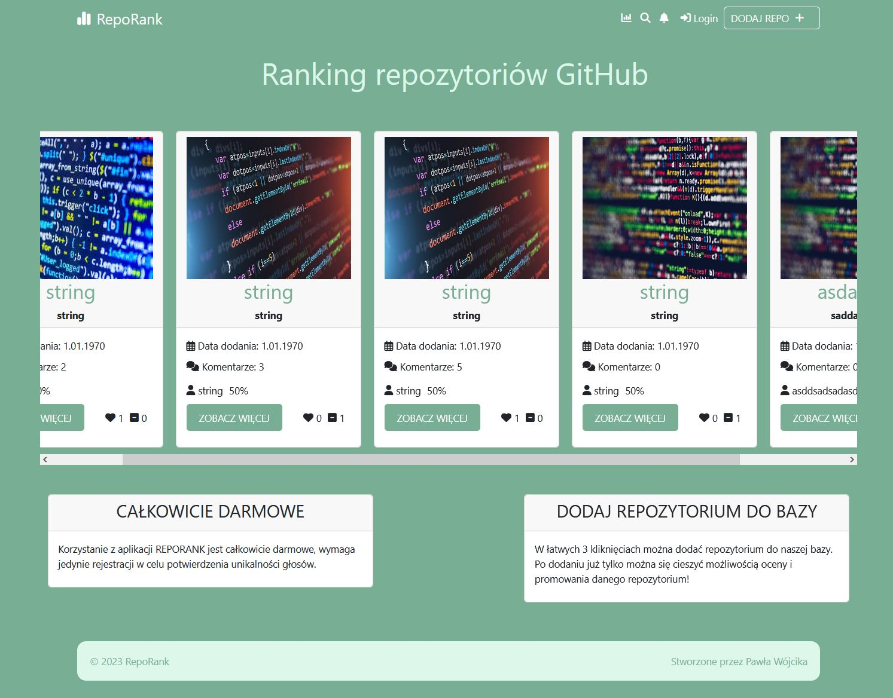
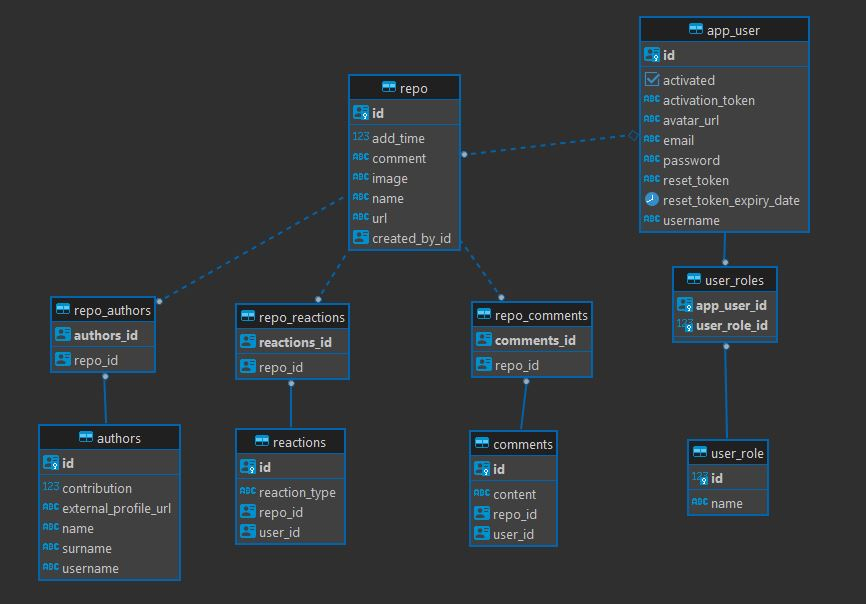
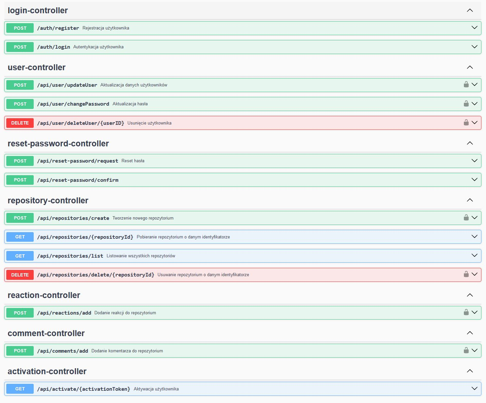

# RepoRank
Strona umożliwia wyrażenie opinii, polubienie oraz przekazanie negatywnej opinii na temat repozytoriów dostępnych w internecie. Strona jest jedynie bazą komentarzy o repozytoriach, nie przechowuje ich kodu oraz wersji.

## Technologie użyte w projekcie
### Backend:
- Spring Boot - silnik backendu
- Java 17+ - język programowania
- Hibernate - ORM
- Swagger v3 - dokumentacja
- PostgreSQL - baza danych
- Bearer Token - autoryzacja użytkowników

### Frontend:
- React - silnik forontendu
- Bearer Token - autoryzacja
- JSON - struktury DTO
- Bootstrap - bibioteka CSS, interfejs graficzny
- Font Awesome - zestaw ikon

## Diagram ERD

## Endpointy backendu:

